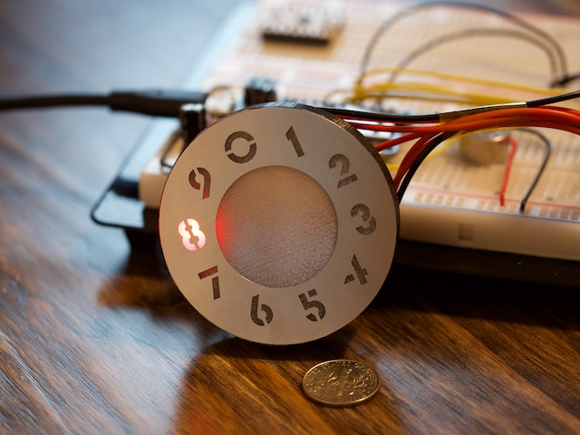
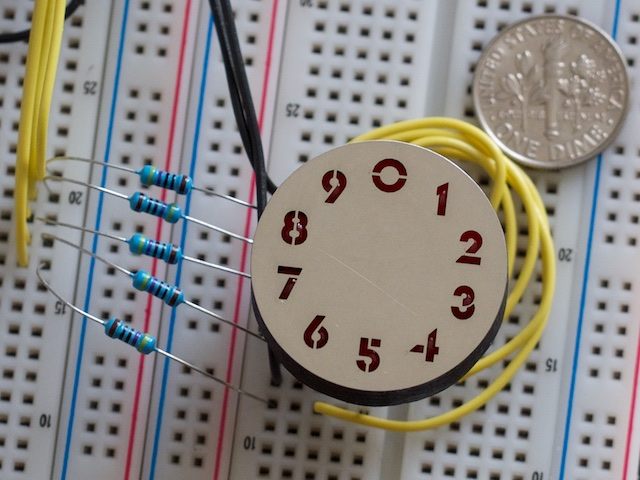

### LED Pixie Tube

Proof of concept for a LED based numeric dekatron/nomotron/[pixie tube](https://www.industrialalchemy.org/articleview.php?item=1108) display.  
LED mask was laser cut out of 8mil stainless steel by [oshstencils.com](oshstencils.com), misusing their service for creating solder mask stencils. And the holder for the LED's was 3D printed out of PLA.

Both prototypes use 5mm LEDs, the small one using standard LED's and the large display using straw hat LED's. The small display works without a diffuser since the digits are the same size as the LEDs. A diffuser does however improve the viewing angle. On the large display a diffuser is pretty much required when using 5mm LEDs, using 10mm LEDs might also work. The diffuser can also be put in-front of the mask in which case the digits are only visible when lit.

The small display fits inside large display, which is how I had them manufactured. However I overlooked how little of a gap there is between the two discs, which makes it stupidly difficult to separate the two sizes. Provided files have been adjusted to account for this and the designs separated.

Large disc, 55mm diameter. Plastic jug diffuser.

Small disc, 28mm diameter. No diffuser, LEDs visible through apertures.

